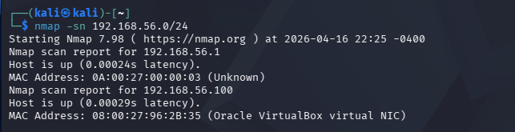
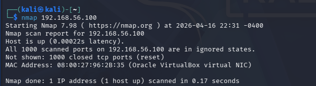
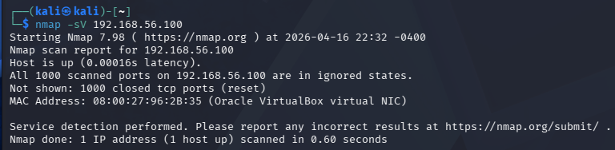

# Nmap Network Scan Lab

## Objective
The purpose of this lab was to perform network reconnaissance using Nmap to identify live hosts, open ports, and services on a local network.

---

## Tools Used
- Nmap
- Kali Linux

---

## Scope
This lab was conducted in a controlled virtual environment for educational purposes.

---

## Steps Performed
1. Identified the local network range using `ip a`
2. Performed host discovery on the subnet
3. Identified active hosts on the network
4. Selected a target system for scanning
5. Conducted a basic port scan
6. Performed service/version detection

---

## Commands Used
```bash```
nmap -sn 192.168.56.0/24
nmap 192.168.56.100
nmap -sV 192.168.56.100


## Findings
- Host discovery identified multiple active devices on the local subnet.
- The selected target (192.168.56.100) responded to Nmap scans, confirming it is online.
- A basic port scan revealed that all 1000 commonly scanned TCP ports were closed or filtered.
- Service/version detection did not identify any active services on the target system.
- These results indicate the system is not exposing network services and may have a limited attack surface.

## Screenshots

### Host Discovery


### Basic Scan


### Service Scan



